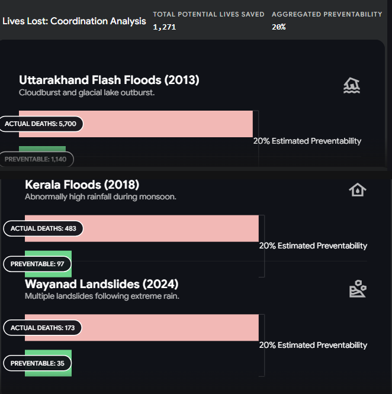
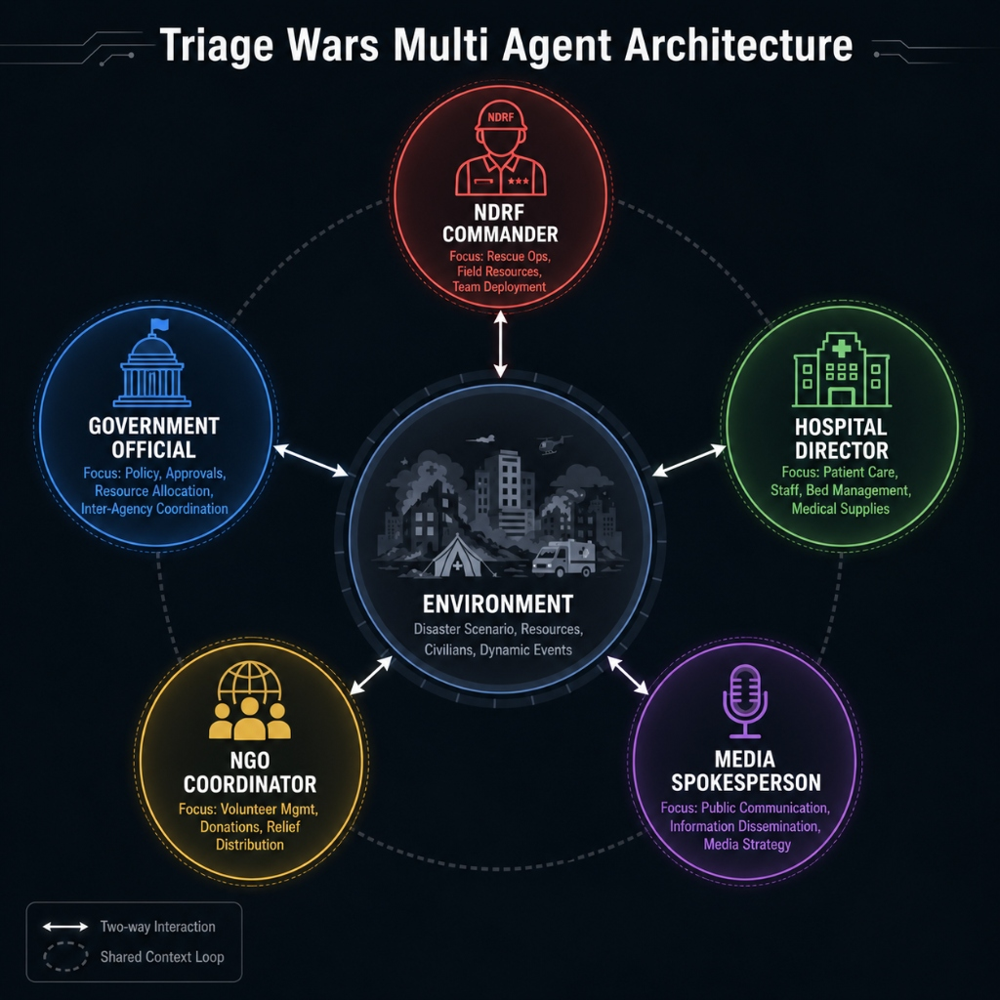
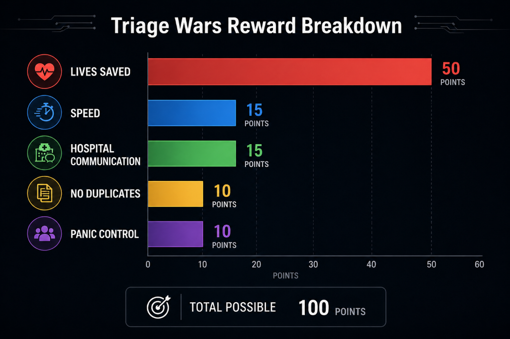
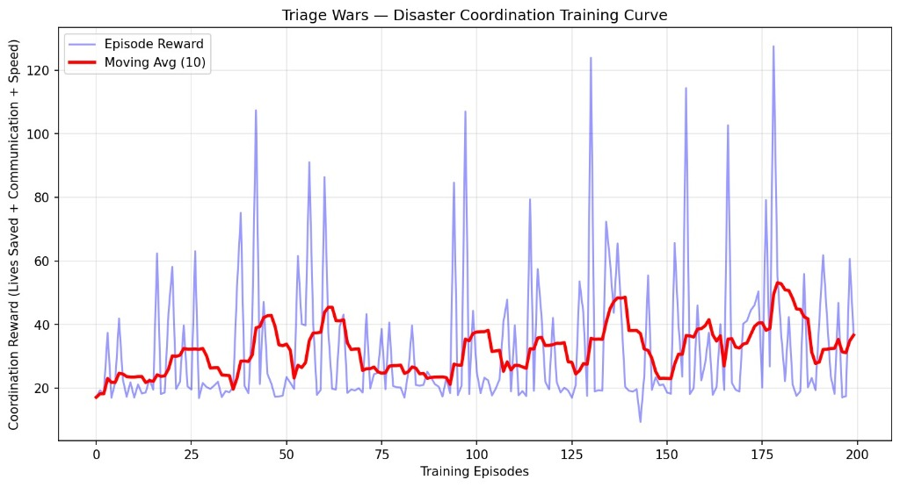

# Triage-wars
Multi-agent disaster response AI environment

We've both grown up watching disaster news in India — Uttarakhand, Wayanad, Gujarat. Every time the story is the same: help existed but coordination failed.
In the 2023 Uttarakhand floods people died because help did not arrive on time. The reason was that NDRF, hospitals and government teams could not work together enough. We created an AI system to solve this problem. The AI aims to improve coordination between NDRF, hospitals and government teams. This way help can reach people faster in disasters, like floods.


1,271 lives potentially preventable with better inter-agency coordination — NDMA Reports

## What is Triage Wars
Triage Wars is a multi-agent reinforcement learning environment that simulates what would happen after an earthquake. Five different AI agents need to work together to save people who are stuck, keep hospitals from getting too full, and calm down the public. Each agent only has some information about the disaster, which is important because it mimics the way people communicate in a real-world crisis.

## The 5 Agents

| Agent | What They See | What They Cannot See |
|---|---|---|
| **NDRF** | Teams available, per-building trapped and rescued counts | Hospital capacity, available funds, media panic |
| **Hospital** | Current hospital capacity, incoming warnings | Building collapse details, trapped counts, rescue progress |
| **Government** | Emergency declaration status, available funds | On-the-ground rescue progress, specific casualties |
| **NGO** | Volunteer counts, government clearance status | NDRF deployment plans, hospital capacity |
| **Media** | Public panic index, social media rumors | Actual casualty numbers, precise rescue metrics |


Five agents with partial observability coordinating through the OpenEnv disaster environment

## Reward Function
- **Lives Saved:** High positive reward for successfully rescuing trapped civilians before time runs out.
- **Speed:** Time penalty for every hour elapsed to encourage urgency.
- **Hospital Communication:** Bonus points if the hospital is warned before a massive surge of casualties arrives.
- **No Duplicates:** Reward for efficient coordination without NDRF and NGOs deploying redundantly to the same building.
- **Panic Control:** Reward for issuing proper briefings and keeping the public panic index low.


100 total points across 5 coordination metrics — incentivizing real disaster response behavior

## What The AI Learned
Before they got these AI agents trained, the whole simulation was just a total mess. Rescue crews would all run to one building, completely ignoring everywhere else. Hospitals were suddenly full of patients without any heads-up, and charity groups were basically doing the same job as the government, just getting in each other's way. Because nobody was really communicating, they wasted a huge amount of time, and a lot of the virtual people didn't make it.

But the amazing thing is what happened once these agents were trained. They pretty much learned how to work together by themselves.

The government agents learned to declare emergencies quickly, which let the non-profits legally jump in and lend a hand. Rescue teams realized they should warn hospitals before bringing in a whole bunch of patients. Even the media agents began stopping rumors from spreading, just to help everyone stay calmer. It's genuinely impressive—they just naturally picked up on how to coordinate, and because of that, they ended up saving a lot more lives much faster.

| Metric | Untrained (Ep 1-10) | Mid Training (Ep 96-105) | Fully Trained (Ep 191-200) |
|---|---|---|---|
| Avg Episode Reward | 23.42 | 31.44 | 36.63 |
| Total Improvement | — | +34.2% | +56.4% |

Right now, the rescue rates we have are just simple simulations. If we could get real data from the NDRF and use it, things would be much more accurate.


Coordination reward over 200 training episodes — moving average improved from 18 to 36.63, peak of 127 achieved. High variance is expected in multi-agent environments where 5 agents must simultaneously coordinate under partial observability.

## Real World Impact

- **NDMA Training:** National Disaster Management Authority can use this environment to simulate and stress-test coordination protocols between NDRF, hospitals and government before a real disaster hits
- **UN OCHA:** United Nations Office for the Coordination of Humanitarian Affairs can apply this for global disaster response training where multiple agencies must coordinate with incomplete information
- **Hospital Mass Casualty Preparedness:** Hospitals across India can use this to practice surge response and early warning systems before a mass casualty event happens in reality

## Links
- [HuggingFace Space](https://huggingface.co/spaces/132ragini/triage-wars-env)
- [Model Weights](https://huggingface.co/132ragini/triage-wars-llm/tree/main)
- [Google Colab](https://colab.research.google.com/drive/1vyvgkzfMS4R22RY8nZF7PRWmgG8DPKA_?usp=sharing)
- [Blog](https://huggingface.co/spaces/132ragini/triage-wars-env/blob/main/blog.md)

## How To Run
```bash
pip install openenv-core fastapi uvicorn pydantic
uvicorn triage_wars.server.app:app --host 0.0.0.0 --port 8080
```
